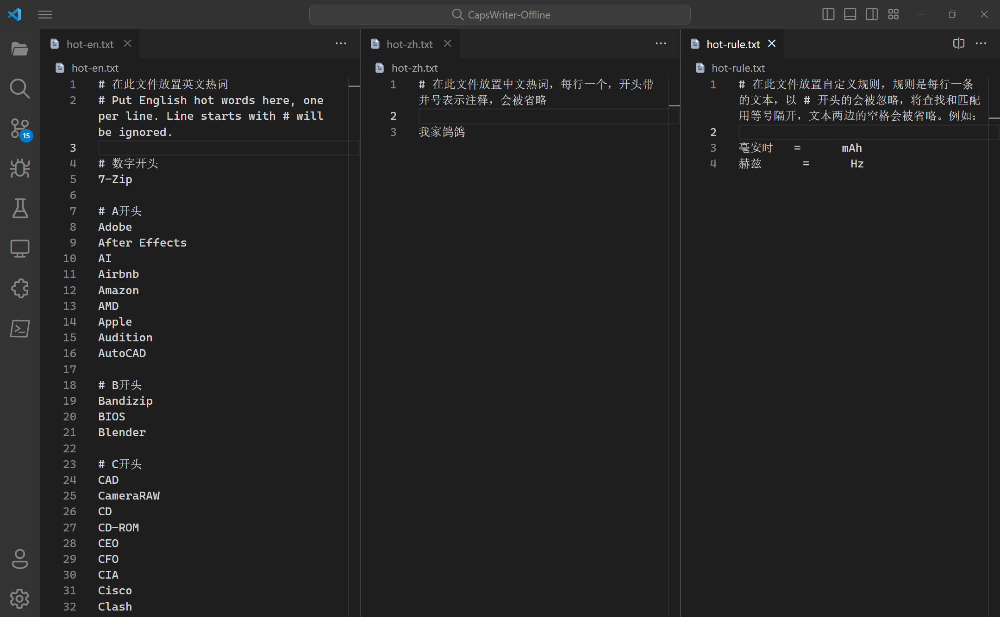
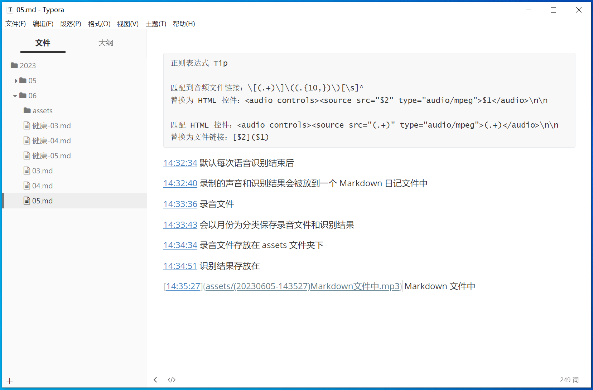

## CapsWriter-Offline

 

这是 `CapsWriter-Offline` ，一个 PC 端的语音输入工具。

运行后，只要按下键盘上的 `大写锁定键`，就会开始录音，当你松开 `大写锁定键` 时，就会识别你的录音，并将识别结果立刻输入。

视频教程：[CapsWriter-Offline 电脑端离线语音输入工具](https://www.bilibili.com/video/BV1fo4y1T7KN/)  

## 特性

1. 完全离线、低延迟、高准确率、中英混输、自动阿拉伯数字、自动调整中英间隔
2. 热词功能：可以在 `hot-en.txt hot-zh.txt hot-rule.txt` 中添加三种热词，客户端动态载入
3. 日记功能：默认每次录音识别后，识别结果记录在 `年份/月份/日期.md` ，录音文件保存在 `年份/月份/assets` 
4. 关键词日记：识别结果若以关键词开头，会被额外记录在 `年份/月份/日期-关键词.md`，关键词在 `keywords.txt` 中定义
5. 服务端、客户端分离，可以让一台主机为局域网内的电脑提供识别服务
6. 用文本编辑器打开 `core_client.py` ，可以编辑服务端地址、快捷键、录音开关……

## 懒人包

对于 Windows10 64 位用户，我打包了 `exe` 版本，可以从百度网盘或者 GitHub Releases界面下载。

对于 MacOS ARM 用户，我也做了打包版本，可以从百度网盘或者 GitHub Releases界面下载。（由于系统限制，客户端需要 sudo 启动，且默认快捷键为 `right shift`）

由于模型文件太大，为了方便更新，打包版本中没有包含模型文件，所以需要分别手动下载软件和模型，模型文件也放在了百度网盘和 GitHub Releases 界面里边。

打包版本里有一个 `models` 文件夹，请把模型文件解压后放到 `models` 里，之后双击 `exe`，分别打开 `Server` 和 `Client` 即可使用。

下载地址：

- 百度盘: https://pan.baidu.com/s/1zNHstoWZDJVynCBz2yS9vg 提取码: eu4c 
- GitHub Release: [Releases · HaujetZhao/CapsWriter-Offline](https://github.com/HaujetZhao/CapsWriter-Offline/releases) 

打包后大小约 1.4G，下载要花些时间，主要是里面包含了模型文件。

（百度网盘容易掉链接，补链接太麻烦了，我不一定会补链接。GitHub Releases 界面下载是最可靠的。）

 

其它系统，可以下载模型、安装依赖后从 Python 源码运行。

## 功能：热词

如果你有专用名词需要替换，可以加入热词文件。规则文件中以 `#` 开头的行以及空行会被忽略，可以用作注释。

- 中文热词请写到 `hot-zh.txt` 文件，每行一个，替换依据为拼音，实测每 1 万条热词约引入 3ms 延迟

- 英文热词请写到 `hot-en.txt` 文件，每行一个，替换依据为字母拼写

- 自定义规则热词请写到 `hot-rule.txt` 文件，每行一个，将搜索和替换词以等号隔开，如 `毫安时  =  mAh` 

你可以在 `core_client.py` 文件中配置是否匹配中文多音字，是否严格匹配拼音声调。

检测到修改后，客户端会动态载入热词，效果示例：

1. 例如 `hot-zh.txt` 有热词「我家鸽鸽」，则所有识别结果中的「我家哥哥」都会被替换成「我家鸽鸽」
2. 例如 `hot-en.txt` 有热词「ChatGPT」，则所有识别结果中的「chat gpt」都会被替换成「ChatGPT」
3. 例如 `hot-rule.txt` 有热词「毫安时 = mAh」，则所有识别结果中的「毫安时」都会被替换成「mAh」




## 功能：日记、关键词

默认每次语音识别结束后，会以年、月为分类，保存录音文件和识别结果：

- 录音文件存放在「年/月/assets」文件夹下
- 识别结果存放在「年/月/日.md」Markdown 文件中

例如今天是2023年6月5号，示例：

1. 语音输入任一句话后，录音就会被保存到 `2023/06/assets` 路径下，以时间和识别结果命名，并将识别结果保存到 `2023/06/05.md` 文件中，方便我日后查阅
2. 例如我在 `keywords.txt` 中定义了关键词「健康」，用于随时记录自己的身体状况，吃完饭后我可以按住 `CapsLock` 说「健康今天中午吃了大米炒饭」，由于识别结果以「健康」关键词开头，这条识别记录就会被保存到 `2023/06/05-健康.md` 中
3. 例如我在 `keywords.txt` 中定义了关键词「重要」，用于随时记录突然的灵感，有想法时我就可以按住 `CapsLock` 说「重要，xx问题可以用xxxx方法解决」，由于识别结果以「重要」关键词开头，这条识别记录就会被保存到 `2023/06/05-重要.md` 中

  


## 注意事项

1. 目前使用的模型是 `Paraformer` 非流式模型，即录完再转，因此录音时间越长，上屏延迟越大。主流性能的 Windows 笔记本，RTF 大约 0.06，即大约每10s 录音需 0.6s 转录时长。
2. 当用户安装了 `FFmpeg` 时，会以 `mp3` 格式保存录音；当用户没有装 `FFmpeg` 时，会以 `wav` 格式保存录音
3. 默认的快捷键是 `caps lock`，你可以打开 `core_client.py` 进行修改
4. MacOS 无法监测到 `caps lock` 按键，可改为 `right shift` 按键

## 修改配置

你可以打开 `core_server.py` ，在开头部分有注释，指导你修改服务端的端口，默认是 `6006`

你可以打开 `core_client.py` ，在开头部分有注释，指导你修改客户端的：

- 连接的地址和端口，默认是 `127.0.0.1` 和 `6006` 
- 键盘快捷键
- 是否要保存录音文件
- 要移除识别结果末尾的哪些标点，（如果你想把问号也删除掉，可以在这边加上）

  


## 下载模型

本工具服务端使用了 [sherpa-onnx](https://k2-fsa.github.io/sherpa/onnx/index.html) ，载入阿里巴巴开源的 [Paraformer](https://www.modelscope.cn/models/damo/speech_paraformer-large_asr_nat-zh-cn-16k-common-vocab8404-pytorch/summary) 模型（[转为onnx格式](https://k2-fsa.github.io/sherpa/onnx/pretrained_models/offline-paraformer/paraformer-models.html)），来作语音识别，整个模型约 1GB 大小。下载有已转换好的模型文件：

- [csukuangfj/sherpa-onnx-paraformer-zh-2023-03-28 at main (huggingface.co)](https://huggingface.co/csukuangfj/sherpa-onnx-paraformer-zh-2023-03-28/tree/main) 

另外，还使用了阿里巴巴的标点符号模型（[转为了onnx格式](https://github.com/alibaba-damo-academy/FunASR/tree/main/funasr/export)）：

- [CT-Transformer标点-中文-通用-pytorch ](https://modelscope.cn/models/damo/punc_ct-transformer_zh-cn-common-vocab272727-pytorch/summary) 

**模型文件太大，并没有包含在 GitHub 库里面，你可以从百度网盘或者 GitHub Releases 界面下载已经转换好的模型文件，解压后，放入 `models` 文件夹。** 

- 模型打包下载：[models-Paraformer-and-Punctuation-X86.zip](https://github.com/HaujetZhao/CapsWriter-Offline/releases/download/v0.3/models-Paraformer-and-Punctuation-X86.zip) （包含了 onnx 格式的 Paraformer 语音模型和 Punctuation 标点模型）


## 源码安装依赖

### Windows 端

```powershell
pip install -r requirements-server.txt
pip install -r requirements-client.txt
```

有些依赖在3.11还暂时不无法安装，建议使用 `python 3.10` 

### Mac 端

在 Arm 芯片的 MacOS 电脑上（如 MacBook M1）无法使用 pip 安装 `sherpa_onnx` ，需要手动从源代码安装：

```
git clone https://github.com/k2-fsa/sherpa-onnx
cd sherpa-onnx
python3 setup.py install
```

在 MacOS 上，安装 `funasr_onnx` 依赖的时候可能会报错，缺失 `protobuf compiler`，可以通过 `brew install protobuf` 解决。

## 源码运行

1. 运行 `core_server.py` 脚本，会载入 Paraformer 模型识别模型（这会占用1GB的内存，载入时长约十几秒）
2. 运行 `core_client.py` 脚本，它会打开系统默认麦克风，开始监听按键（`MacOS` 端需要 `sudo`）
3. 按住 `CapsLock` 键，录音开始，松开 `CapsLock` 键，录音结束，识别结果立马被输入（录音时长短于0.3秒不算）

MacOS 端注意事项：

- MacOS 上监听 `CapsLock` 键可能会出错，需要快捷键修改为其他按键，如 `right shift` 

## 打赏

如果你愿意，可以以打赏的方式支持我一下：

